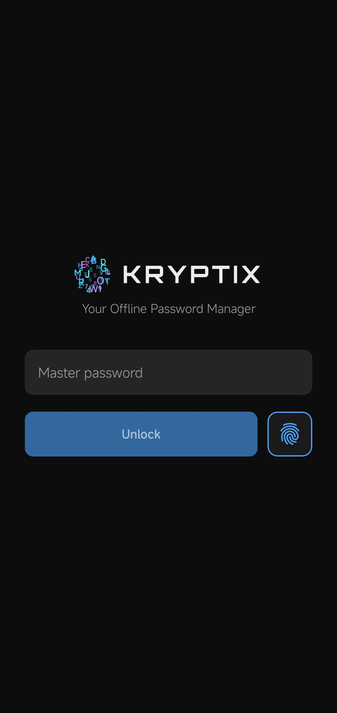
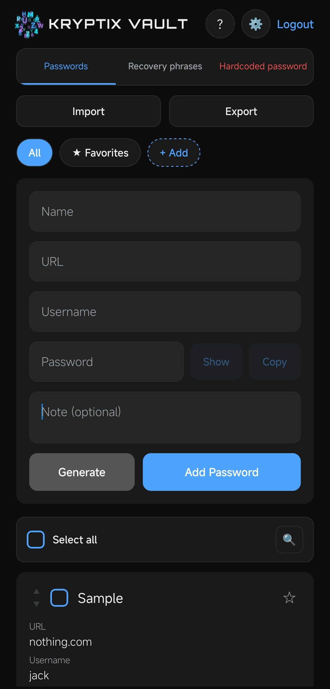

# Kryptix

**Privacy-first offline vault for passwords, recovery phrases, and sensitive secrets.**

Kryptix is a modern, fully offline password manager and secure vault — React Native + Expo on mobile, Tauri 2 on desktop.  
Your data never leaves your device unless **you** explicitly export an encrypted backup. No cloud accounts, no telemetry, no third-party servers.

> **Transparency first.**  
> Password vaults demand trust. The source is available so anyone can inspect the encryption, data handling, and architecture instead of relying on marketing claims.

---

## Screenshots

### Mobile

| Login / unlock | Vault |
|:--------------:|:-----:|
|  |  |

### Desktop

| Unlock | Passwords |
|:------:|:---------:|
|  |  |

---

## Why Kryptix?

Most password managers push you into the cloud. Kryptix takes the opposite approach:

- **True offline** — Works completely offline after install. Secrets stay on the device.
- **Purpose-built vaults** — Separate sections for everyday passwords, crypto recovery phrases, and high-sensitivity “hardcoded” values.
- **Strong encryption** — AES-256 with key stretching and integrity protection for full-vault backups (`.kryptix` format).
- **Biometric unlock** — Face ID / fingerprint after master-password authentication.
- **14 languages** — English, Persian, Russian, German, French, Chinese, Arabic, Turkish, Japanese, Spanish, Portuguese, Italian, Greek, Korean (LTR layout).
- **Intentional UX** — Distinctive intro animation, clean vault interface, and careful handling of sensitive data (show/hide, decrypt-on-demand, per-entry copy controls).

Kryptix is designed for people who want a serious, verifiable tool for their most important digital assets.

---

## Features

| Section              | Purpose                                      | Highlights |
|----------------------|----------------------------------------------|------------|
| **Passwords**        | Everyday logins                              | Categories, favorites, strong generator, JSON/CSV import & export |
| **Recovery Phrases** | Crypto / wallet seed phrases                 | Name, phrase, notes, favorites, word count, show/hide, copy, search |
| **Hardcoded**        | PINs, emergency codes, ultra-sensitive values | Decrypt-on-demand, per-entry `allowCopy`, multiple algorithms |

### Encrypted Full-Vault Backup (`.kryptix`)
- Export the entire vault (passwords + recovery phrases + hardcoded) into a single encrypted file
- AES-256-CBC + SHA-256 key stretching (KDF) + MAC for integrity
- Import with **merge** or **replace** options
- Protected by a separate export passphrase chosen by the user

### Internationalization
Full support for 14 languages with consistent LTR layout. Shell and settings are translated; panel strings continue to be wired to the translation system.

### Desktop
Native desktop companion built with **Tauri 2 + React + TypeScript** (`desktop/`). Shared core package (`packages/core`) for encryption, types, and vault format. Full vault UI with Passwords, Recovery, and Hardcoded panels, import/export, and auto-lock.

---

## Security Model (High Level)

Kryptix follows a local-first, user-controlled design:

- **No network dependency** after install — the app does not require internet to function.
- **Client-side encryption** — Sensitive data is protected on device. The application never sends vault contents to a server.
- **Master password** is the root of trust. Biometrics are a convenience layer only and are disabled until the user unlocks with the master password and opts in.
- **Recovery phrases** receive dedicated handling (show/hide, word count awareness, careful copy controls) rather than being treated as ordinary notes.
- **Hardcoded entries** are decrypted only when the user explicitly requests it. Per-entry copy permission is configurable.
- **Full-vault backups** use AES-256-CBC, a stretched key derived from a user-chosen passphrase, and a MAC so tampering can be detected.
- **Clipboard control** — Individual entries can restrict or allow copying.

We believe the strongest trust signal for a password vault is the ability for independent parties to review the code. The repository is public for transparency and audit — under a source-available (noncommercial) license, not a permissive open-source license.

> For vulnerability reports, please open a private security advisory or contact the maintainer. See [`SECURITY.md`](SECURITY.md) when available.

---

## Getting Started

### Mobile (Expo)
```bash
npm install
npx expo start
```

### Desktop (Tauri 2)
```bash
cd desktop
npm install
npm run tauri dev
```

See `desktop/README.md` (if present) and the packages under `packages/core` for shared encryption and vault format details.

---

## Backup format

`.kryptix` files are encrypted full-vault archives. They contain passwords, recovery phrases, and hardcoded entries. Import supports merge or replace. Always keep a strong export passphrase and store the file somewhere safe.

---

## Legal

- [Privacy Policy](https://nima-mehr.github.io/Kryptix/privacy/)
- [Terms of Service](https://nima-mehr.github.io/Kryptix/terms/)

Canonical URLs are also exported from `@kryptix/core` for in-app links.

---

## License

**Source-available** under the [PolyForm Noncommercial License 1.0.0](https://polyformproject.org/licenses/noncommercial/1.0.0) — see [LICENSE](LICENSE).

You may view, study, and contribute to the source for noncommercial purposes. Commercial use, resale, and republishing the software as a product require a separate commercial license from the copyright holder.

---

## Roadmap (high level)

- [x] Mobile vault (passwords, recovery phrases, hardcoded)
- [x] Biometric unlock (mobile + desktop)
- [x] Full-vault `.kryptix` encrypted backup
- [x] Desktop companion (Tauri 2)
- [x] Shared `@kryptix/core` package
- [x] Categories & FAQ/About on desktop
- [ ] Mobile Settings links to hosted Privacy / Terms
- [ ] Additional polish and store submissions

---

## Contributing

Source is public for transparency and review. Contributions that improve security, correctness, accessibility, or documentation are welcome. By contributing you agree that your contributions are licensed under the same PolyForm Noncommercial terms unless otherwise agreed in writing.
