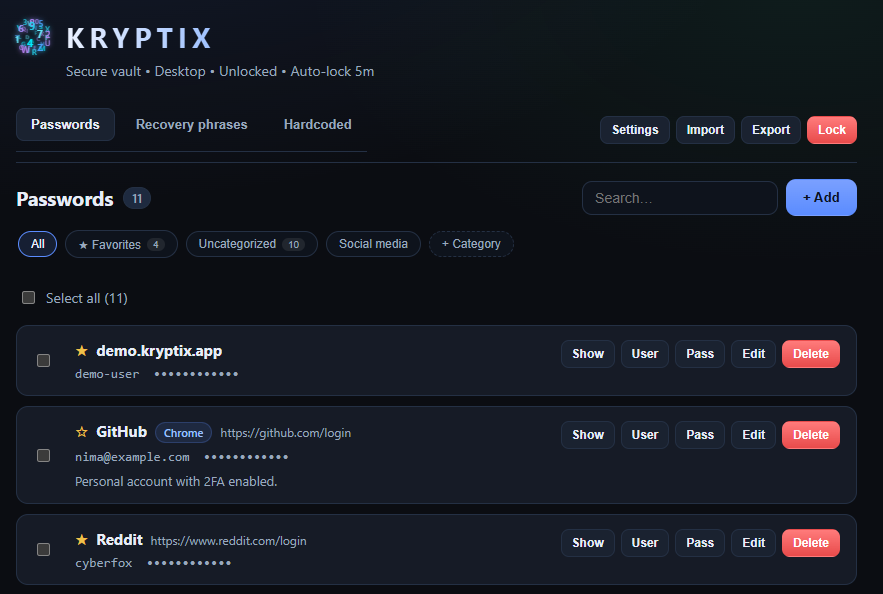

# Kryptix

**Privacy-first offline vault for passwords, recovery phrases, and sensitive secrets.**

Kryptix is a modern, fully offline password manager and secure vault — React Native + Expo on mobile, Tauri 2 on desktop.  
Your data never leaves your device unless **you** explicitly export an encrypted backup. No cloud accounts, no telemetry, no third-party servers.

> **Transparency first.**  
> Password vaults demand trust. The source is available so anyone can inspect the encryption, data handling, and architecture instead of relying on marketing claims.

---

## Screenshots

### Mobile

<!-- Replace the placeholders below with real screenshots (e.g. docs/screenshots/mobile-*.png) -->

| Login / unlock | Vault | Recovery phrases |
|:--------------:|:-----:|:----------------:|
|  |  |  |

*Add 2–4 mobile screenshots here (login, passwords list, recovery phrase, settings).*

### Desktop

<!-- Replace the placeholders below with real screenshots (e.g. docs/screenshots/desktop-*.png) -->

| Unlock | Passwords | Settings / export |
|:------:|:---------:|:-----------------:|
|  |  |  |

*Add 2–4 desktop screenshots here (unlock, passwords panel, recovery, export/import).*

> Tip: keep screenshots free of real secrets. Use demo data only. Prefer dark theme captures to match the app.

---

## Why Kryptix?

Most password managers push you into the cloud. Kryptix takes the opposite approach:

- **True offline** — Works completely offline after install. Secrets stay on the device.
- **Purpose-built vaults** — Separate sections for everyday passwords, crypto recovery phrases, and high-sensitivity “hardcoded” values.
- **Strong encryption** — AES-256 with key stretching and integrity protection for full-vault backups (`.kryptix` format).
- **Biometric unlock** — Face ID / fingerprint after master-password authentication.
- **14 languages** — English, Persian, Russian, German, French, Chinese, Arabic, Turkish, Japanese, Spanish, Portuguese, Italian, Greek, Korean (LTR layout).
- **Intentional UX** — Distinctive intro animation, clean vault interface, and careful handling of sensitive data (show/hide, decrypt-on-demand, per-entry copy controls).

Kryptix is designed for people who want a serious, verifiable tool for their most important digital assets.

---

## Core Features

### Master Password + Biometrics
- Strong master password protection
- Optional biometric unlock (Face ID / fingerprint) via `expo-local-authentication`
- Biometrics only enabled after successful password unlock; preference stored securely

### Three Specialized Vaults

| Section              | Purpose                                      | Highlights |
|----------------------|----------------------------------------------|------------|
| **Passwords**        | Everyday logins                              | Categories, favorites, strong generator, JSON/CSV import & export |
| **Recovery Phrases** | Crypto / wallet seed phrases                 | Name, phrase, notes, favorites, word count, show/hide, copy, search |
| **Hardcoded**        | PINs, emergency codes, ultra-sensitive values | Decrypt-on-demand, per-entry `allowCopy`, multiple algorithms |

### Encrypted Full-Vault Backup (`.kryptix`)
- Export the entire vault (passwords + recovery phrases + hardcoded) into a single encrypted file
- AES-256-CBC + SHA-256 key stretching (KDF) + MAC for integrity
- Import with **merge** or **replace** options
- Protected by a separate export passphrase chosen by the user

### Internationalization
Full support for 14 languages with consistent LTR layout. Shell and settings are translated; panel strings continue to be wired to the translation system.

### Desktop
Native desktop companion built with **Tauri 2 + React + TypeScript** (`desktop/`). Shared core package (`packages/core`) for encryption, types, and vault format. Full vault UI with Passwords, Recovery, and Hardcoded panels, import/export, and auto-lock.

---

## Security Model (High Level)

Kryptix follows a local-first, user-controlled design:

- **No network dependency** after install — the app does not require internet to function.
- **Client-side encryption** — Sensitive data is protected on device. The application never sends vault contents to a server.
- **Master password** is the root of trust. Biometrics are a convenience layer only and are disabled until the user unlocks with the master password and opts in.
- **Recovery phrases** receive dedicated handling (show/hide, word count awareness, careful copy controls) rather than being treated as ordinary notes.
- **Hardcoded entries** are decrypted only when the user explicitly requests it. Per-entry copy permission is configurable.
- **Full-vault backups** use AES-256-CBC, a stretched key derived from a user-chosen passphrase, and a MAC so tampering can be detected.
- **Clipboard control** — Individual entries can restrict or allow copying.

We believe the strongest trust signal for a password vault is the ability for independent parties to review the code. The repository is public for transparency and audit — under a source-available (noncommercial) license, not a permissive open-source license.

> For vulnerability reports, please open a private security advisory or contact the maintainer. See [`SECURITY.md`](SECURITY.md) when available.

---

## Tech Stack

**Mobile**
- React Native + Expo (TypeScript)
- Expo Router
- SecureStore for sensitive preferences
- Custom encryption utilities
- `expo-local-authentication` for biometrics
- Multi-language i18n system

**Desktop**
- Tauri 2 + React + TypeScript
- Shared `@kryptix/core` package (encryption, types, `.kryptix` format)
- tauri-plugin-store + AES-256 encrypt-at-rest via master password

---

## Getting Started (Development)

```bash
# Install dependencies
npm install

# Start the Expo development server (mobile)
npx expo start

# Desktop (from desktop/)
cd desktop && npm install && npm run tauri dev
```

Then open the mobile app in Expo Go, an iOS Simulator, or an Android Emulator.

### Project structure (key parts)

```
app/                  # Expo Router entry points
screens/              # Login, VaultHome, and related screens
components/           # UI components, tabs, backup modal, logo
utils/                # Encryption, biometrics, recovery, hardcoded, kryptix backup, import/export
types/                # TypeScript definitions (passwords, recovery, hardcoded, vault format)
i18n/                 # Translation packs and registry
context/              # Theme & language context
packages/core/        # Shared types, encryption, legal URLs
desktop/              # Tauri 2 desktop app
docs/                 # GitHub Pages (Privacy, Terms) + screenshot placeholders
```

---

## Roadmap (high level)

- [x] Passwords vault with import/export
- [x] Recovery phrases CRUD + dedicated UX
- [x] Hardcoded passwords with decrypt-on-demand
- [x] Biometric unlock (post master-password)
- [x] Full-vault encrypted `.kryptix` backup / restore
- [x] Multi-language support (14 languages)
- [x] Shared `@kryptix/core` package
- [x] Desktop vault UI (Passwords / Recovery / Hardcoded) + import/export
- [ ] Mobile Settings links to Privacy & Terms
- [ ] Additional hardening and documentation
- [ ] Independent security review (planned)
- [ ] Public repository + store listings

---

## Contributing

Contributions, security feedback, and thoughtful issue reports are welcome.  
Please open an issue or pull request. For security-sensitive reports, prefer a private channel when possible.

---

## License

**Source-available** under the [PolyForm Noncommercial License 1.0.0](https://polyformproject.org/licenses/noncommercial/1.0.0) — see [LICENSE](LICENSE).

This is **not** open source (OSI). The source is published so users and security researchers can audit the encryption and data handling. You may use, study, and modify the code for **noncommercial** purposes. You may **not** sell the software, republish it as your own product, or use it for commercial purposes without a separate commercial license from the copyright holder.

Contributions are welcome; by submitting a pull request you agree that your contribution is licensed under the same terms.

---

## Legal

| Document | URL |
|----------|-----|
| [Privacy Policy](PRIVACY_POLICY.md) | https://nima-mehr.github.io/Kryptix/privacy/ |
| [Terms of Service](TERMS_OF_SERVICE.md) | https://nima-mehr.github.io/Kryptix/terms/ |
| Legal home | https://nima-mehr.github.io/Kryptix/ |

Hosted from [`docs/`](docs/) via **GitHub Pages**. Markdown sources live at the repo root.

**App Store / Play Console:** paste the Privacy URL into the required privacy-policy field. The same links should be reachable inside the app (desktop Settings already opens them).

Canonical constants: `packages/core/src/legal.ts` (`PRIVACY_POLICY_URL`, `TERMS_OF_SERVICE_URL`).

---

**Kryptix** — Your secrets, under your control.
